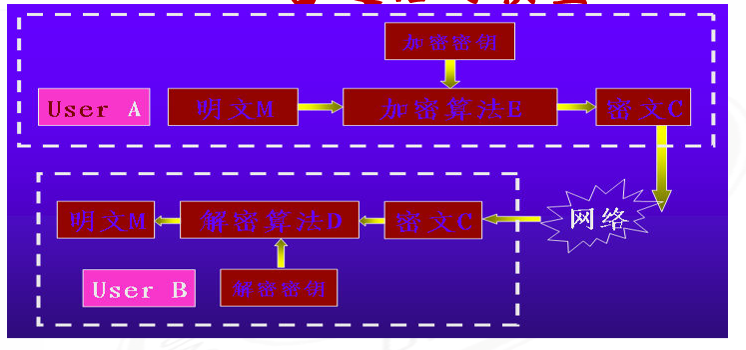
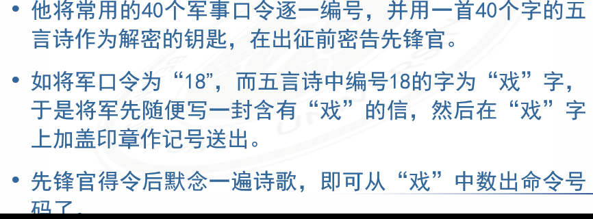
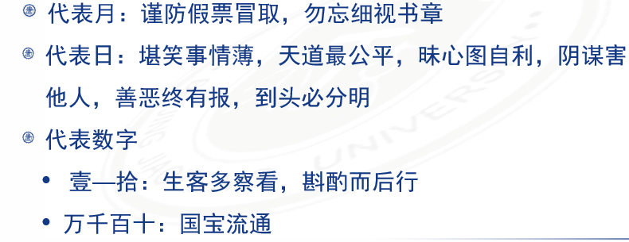

# 第一章

## 信息安全事件

### Wannacry软件蠕虫

2017年5月12日，对我国大量行业内网造成大规模感染

## 密码学基本概念

### 什么是密码

密码是一种用来混淆的技术，希望将正常的、可识别的信息转变为无法识别的信息

密码学是一个即古老又新兴的学科

### 密码学

- 研究信息在系统中如何表示，如何针对这个表示来计算其被破解的代价的学问。显而易见，密码学被分类成密码编码学和密码分析学
- 这个两个问题相互对立又相互促进，密不可分

### 基础术语

- 消息称为明文
- 伪装或隐藏的过程称为加密
- 消息加密后称为密文
- 密文转为明文称为解密
- 密码算法时用于加密和解密的数学函数

加密和解密算算法的操作都是在一组密钥的控制下进行的，分别称为加密密钥和解密密钥

#### 加密通信的模型

***密码学的目的***，在不安全的信道上进行通信，而破译者不能理解他们的内容

### 密码体制定义

一个密码体制满足一下条件的五元组（P, C, K, E, D）

1. P代表所有可能的明文组成的有限集
2. C代表所有可能的密文组成的有限集
3. K代表密钥空间，由所有可能的密钥组成的有限集
4. 对任意的K，都存在一个加密法则和对应的解密法则。并且对每一个加密法则ek：P→C，解密法则dk：C→P，对任意的明文x,均有$dk(ek(x))=x$ 

#### 实用密码体制需要满足的基本条件

1. 每个加密函数ek和每个解密函数dk都能被有效计算
2. 即使看到密文串y，窃听者Oscar确定所用的密钥k或明文串x都是不可行的

## 密码体制分类

### 按照密钥特点

***对称密码算法*** ：

加密密钥和解密密钥相同，又称秘密密钥算法或单密钥算法

***非对称密码算法：***

加密密钥和解密密钥不同，又称公开密钥算法

### 按照明文处理方式

- 分组密码：
将明文分成固定长度的组，用同一密钥和算法对每一块加密，输出也是固定长度的密文
- 流密码
又称序列密码，每次加密一位或一字节的明文

## 密码学的起源和发展

- 古代加密方法（手工阶段）
起源于公元前440年
现今信息隐藏的始祖：
隐形墨水
字符格式变化
图像
把一条羊皮螺旋地缠绕在一个圆柱棒上
北宋曾公亮发明了我国第一个军事密码本
    
    
    
    用汉字做符号
    
    
    
- 古典密码学（机械阶段）
单表代替密码
Caesar密码
多表代替密码：
- Vigenere密码
Hill密码
轮转密码：
Enigma
- 现代密码学（计算机阶段）
1949年信息论之父C.E.Shannon发表文章
密码学走上科学和理性之路
1977年DES正式成为标准
20世纪80年代，出现IDEA、RCx、CAST等
20世纪90年代，对称密码进一步成熟：Rijndael、RC6、MARS、Serpent等出现
2001年Rijndael成为DES的替代者
1976年Diffie和Hellman提出公钥密码思想
1977年Rivest、Shamir、Adleman提出RSA公钥密码算法
20世纪90年代，逐步出现椭圆曲线算法等其他公钥算法
**公钥密码使得发送端和接收端无密钥传输的保密通信成为可能**

#### 密码破译手段

1. 破译原则：遵循观察与经验
2. 方法：采用归纳与演绎
3. 步骤：分析、假设、推测和证实
4. 三大要素：
语言的频率特征
连接特征
重复特征

## 密码体制的安全性

### 计算上安全(Computationally secure)

#### 核心思想

- 考虑攻破密码体制所需付出的计算代价
    - 破译的代价超出信息本身的价值
    - 破译时间超出信息的有效期
- 如果使用最好的算法攻破一个密码体制需要至少N次，这里N是指一个特定的非常大的数字，则这个密码体制是安全的
- 缺点：
    
    没有一个已知的实际的密码体制在这个定义下是安全的
    
    - 实际中，人们经常通过几种特定的攻击类型来研究计算上的安全性，例如穷尽密钥搜索攻击
    - 当然对一种类型的攻击是安全的，并不代表对其它类型的攻击是安全的

### 可证明安全(provable security)

- 核心思想
    
    将密码体制的安全性归结为某个经过深入研究的数学难题
    
- 例如，可以证明这样一类命题：如果给定的整数n是不可分解的，那么给定的密码体制是不可破解的
    
    则称其为可证明安全
    
- 必须注意
    
    这种途径只是说明了安全和另一个问题是相关的，并没有完全证明是安全的
    

### 无条件安全(Unconditionally secure)

- 核心思想
    
    对攻击者的计算量没有限制时的安全性
    
- 即使提供了无穷的计算资源，也是无法攻破的，这种密码体制称为无条件安全的
- 无论破译者又多少种密文，他也无法接触对应的明文，即使解出，也无法验证正确性

## 密码学研究的基本问题

- 密码体制相关概念
- 单向函数与伪随机序列生成器
- 数字签名与杂凑(Hash)函数
- 消息认证和身份识别
- 各类密码协议：如密钥分发、秘密共享、零知识证明

## 密码学的应用

- 密码学时信息安全的核心
- 密码学的发展大大促进了其他学科的发展
- 密码学的现实应用领域
1. 军事外交等机要通信
2. 电子政务、电子商务、金融证券
3. 信息安全的各个领域