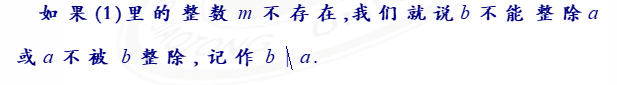
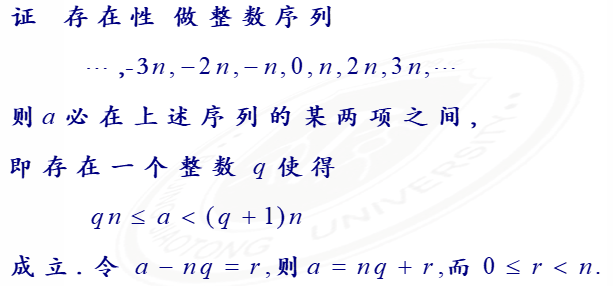

# 第二章

Created: March 13, 2022 8:59 PM

## 整除性和带余除法

### 整除性

如果$a=bm$成立

就称b整除a或者a可被b整除，记作b|a，此时把b称为a的因数，把a称作b的倍数

#### 整除性

a | b, b | c, → a | c

a | b, a | c, →a | (m * b+ n * c)

#### 带余除法

如果a、n是两个整数，n>0，则存在两个整数q和r，使得

a = n * q + r, 0≤r<n; q=[a / n]

成立，q、r唯一

证明思路：

1. 唯一性：假设q、r不唯一，只要证明r1 = r, q1 = q即可
2. 存在性：
    
    
    

定义 q 为不完全商，r 叫做a 被 n 除得到的余数

### 应用

#### 整数分类

设 a > 0. 任一整数被 a 整除后所得到的最小非负余数是且仅是0，1，……，a-1 这 a 个数中的一个。

通过全体整数被 a 除后可分为两两不相交的 a 个类

## 最大公约数定义和性质