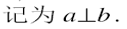
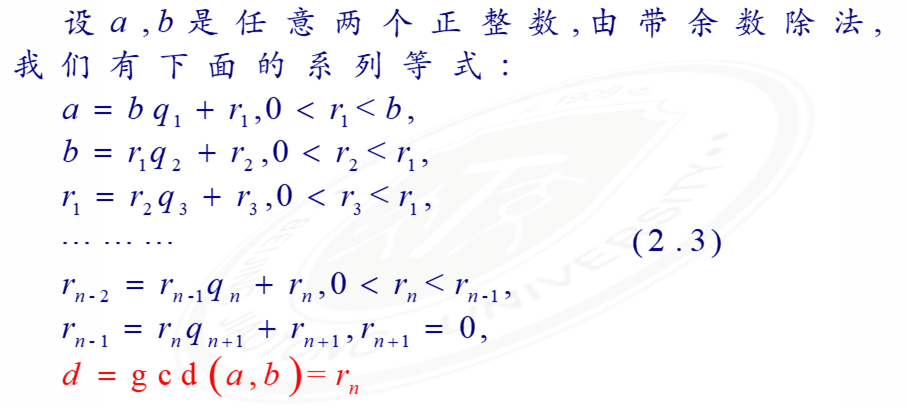
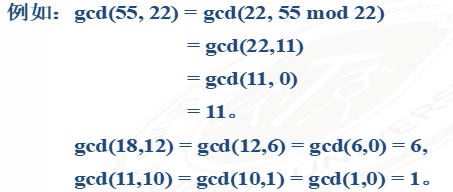
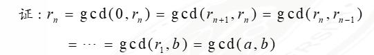
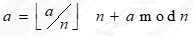
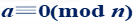

# 第二章

Created: March 13, 2022 8:59 PM


- [第二章](#第二章)
  - [整除性和带余除法](#整除性和带余除法)
    - [整除性](#整除性)
      - [整除性](#整除性-1)
      - [带余除法](#带余除法)
    - [应用](#应用)
      - [整数分类](#整数分类)
  - [最大公约数定义和性质](#最大公约数定义和性质)
    - [定义（最大公因数，互素）](#定义最大公因数互素)
    - [求解](#求解)
      - [定理1](#定理1)
      - [定理2](#定理2)
      - [算法流程](#算法流程)
## 整除性和带余除法

### 整除性

如果$a=bm$成立

就称b整除a或者a可被b整除，记作b|a，此时把b称为a的因数，把a称作b的倍数


#### 整除性

a | b, b | c, → a | c

a | b, a | c, →a | (m * b+ n * c)

#### 带余除法

如果a、n是两个整数，n>0，则存在两个整数q和r，使得

a = n * q + r, 0≤r<n; q=[a / n]

成立，q、r唯一

证明思路：

1. 唯一性：假设q、r不唯一，只要证明r1 = r, q1 = q即可
2. 存在性：
    
    
    

定义 q 为不完全商，r 叫做a 被 n 除得到的余数

### 应用

#### 整数分类

设 a > 0. 任一整数被 a 整除后所得到的最小非负余数是且仅是0，1，……，a-1 这 a 个数中的一个。

通过全体整数被 a 除后可分为两两不相交的 a 个类


## 最大公约数定义和性质
### 定义（最大公因数，互素）

两个整数a, b的最大公因数c>0满足

- c是a, b的公因数，即c | a, c | b
- a, b任意公因数均是c的因数，即d | a, a | b, 则d | c
a, b的最大公因数记为gcd(1, b)，如果gcd(a, b)=1，则说明a, b互素，
    
    
    

### 求解

- 因数分解
    
    列举所有因子，大整数的因子分解是困难问题
    
- 欧几里得算法（辗转相除法）
    
    
    
    假设r3 = 0
    
    $r1=r2*q3$
    
    $b=r2*q3+r2=r2*(q3+1)$
    
    $a=r2*(q3+1)*q1+r2*q3=r2*[(q3+1)*q1+q3]$
    
    每进行一次带余除法，余数至少减一，b是有限的，所有至多进行b次带余除法
    
    总可以得到一个余数为0的等式
    
    在西方称为欧几里得算法，中国古代《九章算术》中称为“更相减损术”
#### 定理1

对任意非负整数a和正整数b，有

$gcd(a,b)=gcd(b,a-kb)=gcd(b,r)$

$a=kb+r$

求两个数的最大公因子时，可以重复使用以上结论



#### 定理2

若a, b是任意两个整数，则(a,b)就是就是最后一个不等于0的余数，即

$(a,b)=rn$



#### 算法流程

```
Euclid(a,b)
1. X<-a; Y<-b;
2. if Y=0 then return X=gcd(a,b);
3. R=X mod Y;
4. X=Y;
5. Y=R;
6. goto 2

时间复杂度O(logn)
```

设n为正整数，a是整数，n除a，商为q，余数为r，则

$a=qn+r$


a mod n 表示余数 r，则



如果(a mod n)=(b mod n)，则称a和b模n同余
记为


称与a模n同余的数的全体为a的同余类，记为
[a]，称a为这个同余类的表示元素

<font color=red>**注意：如果
则 n | a.
</font>

