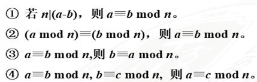
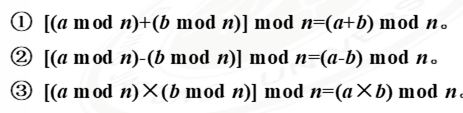
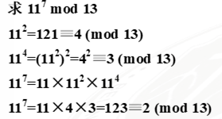
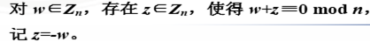
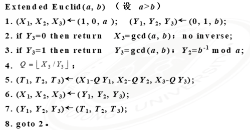
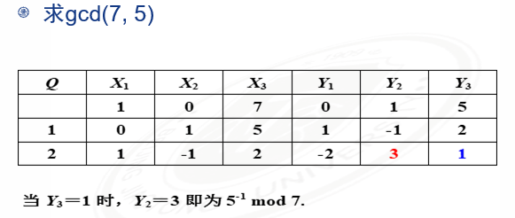

# 第二章

Created: March 13, 2022 8:59 PM


- [第二章](#第二章)
  - [整除性和带余除法](#整除性和带余除法)
    - [整除性](#整除性)
      - [整除性](#整除性-1)
      - [带余除法](#带余除法)
    - [应用](#应用)
      - [整数分类](#整数分类)
  - [最大公约数定义和性质](#最大公约数定义和性质)
    - [定义（最大公因数，互素）](#定义最大公因数互素)
    - [求解](#求解)
      - [定理1](#定理1)
      - [定理2](#定理2)
      - [算法流程](#算法流程)
      - [同余的性质](#同余的性质)
      - [模运算性质](#模运算性质)
      - [模算术运算](#模算术运算)
        - [加法](#加法)
        - [乘法](#乘法)
    - [扩展欧几里得算法](#扩展欧几里得算法)
    - [素数](#素数)

## 整除性和带余除法

### 整除性

如果$a=bm$成立

就称b整除a或者a可被b整除，记作b|a，此时把b称为a的因数，把a称作b的倍数


#### 整除性

a | b, b | c, → a | c

a | b, a | c, →a | (m * b+ n * c)

#### 带余除法

如果a、n是两个整数，n>0，则存在两个整数q和r，使得

a = n * q + r, 0≤r<n; q=[a / n]

成立，q、r唯一

证明思路：

1. 唯一性：假设q、r不唯一，只要证明r1 = r, q1 = q即可
2. 存在性：
    
    
    

定义 q 为不完全商，r 叫做a 被 n 除得到的余数

### 应用

#### 整数分类

设 a > 0. 任一整数被 a 整除后所得到的最小非负余数是且仅是0，1，……，a-1 这 a 个数中的一个。

通过全体整数被 a 除后可分为两两不相交的 a 个类


## 最大公约数定义和性质
### 定义（最大公因数，互素）

两个整数a, b的最大公因数c>0满足

- c是a, b的公因数，即c | a, c | b
- a, b任意公因数均是c的因数，即d | a, a | b, 则d | c
a, b的最大公因数记为gcd(1, b)，如果gcd(a, b)=1，则说明a, b互素，
    
    
    

### 求解

- 因数分解
    
    列举所有因子，大整数的因子分解是困难问题
    
- 欧几里得算法（辗转相除法）
    
    
    
    假设r3 = 0
    
    $r1=r2*q3$
    
    $b=r2*q3+r2=r2*(q3+1)$
    
    $a=r2*(q3+1)*q1+r2*q3=r2*[(q3+1)*q1+q3]$
    
    每进行一次带余除法，余数至少减一，b是有限的，所有至多进行b次带余除法
    
    总可以得到一个余数为0的等式
    
    在西方称为欧几里得算法，中国古代《九章算术》中称为“更相减损术”
#### 定理1

对任意非负整数a和正整数b，有

$gcd(a,b)=gcd(b,a-kb)=gcd(b,r)$

$a=kb+r$

求两个数的最大公因子时，可以重复使用以上结论


#### 定理2

若a, b是任意两个整数，则(a,b)就是就是最后一个不等于0的余数，即

$(a,b)=rn$


#### 算法流程

```
Euclid(a,b)
1. X<-a; Y<-b;
2. if Y=0 then return X=gcd(a,b);
3. R=X mod Y;
4. X=Y;
5. Y=R;
6. goto 2

时间复杂度O(logn)
```

设n为正整数，a是整数，n除a，商为q，余数为r，则

$a=qn+r$


a mod n 表示余数 r，则


如果(a mod n)=(b mod n)，则称a和b模n同余
记为


称与a模n同余的数的全体为a的同余类，记为
[a]，称a为这个同余类的表示元素

<font color=red>**注意：如果
则 n | a.
</font>

#### 同余的性质



<mark>**同余类中的每一元素都可以作为这个同余类的表示元素**

#### 模运算性质



幂运算个普通运算可以通过反复乘法实现



#### 模算术运算

##### 加法

对每一x，都有一y，使得x+y==0 mod 8，则称y为x的负数，也称加法逆元

##### 乘法

对x，若有x*y==1 mod 8，则称y为x的倒数，也称乘法逆元

<mark>并非所有x都有乘法逆元

定义Zn为小于n的所有非负整数集合，即Zn={0,1,2……n-1}

称Zn为模n的同余类集合

>交换律
>
>$(w+x)\quad mod\quad n=(x+w)\quad mod \quad n$
>
>$(w*x)\quad mod\quad n=(x*w)\quad mod\quad n$

>结合律
>
>$[(w+x)+y]\quad mod\quad n=[w+(x+y)]\quad mod\quad n$
>
>$[(w*x)*y]\quad mod|quad n=[w*(x*y)]\quad mod\quad n$

>分配律
>
>$[w*(x+y)]\quad mod\quad n=[w*x+w*y]\quad mod\quad n$

>单位元
>
>$(0+w)\quad mod\quad n=w\quad mod\quad n$
>
>$(1*w)\quad mod\quad n=w\quad mod\quad n$

>加法逆元
>
>

对于$(a+b)\quad mod\quad n==(a+c)\quad mod\quad n$
则$n==c\quad mod\quad n$
称为加法的可约律

<mark>不一定适用于乘法

<mark>与n互素的数都存在乘法逆元

如果$(a*b)==(a*c)\quad mod\quad n$且a有乘法逆元，那么$b==c\quad mod\quad n$

欧几里得算法

- 求两个正整数的最大公因子
- 推广的算法不仅可以求出两个正整数的最大公因子，当两个正整数互素时，还可以求出其中一个数关于另一个数的乘法逆元

### 扩展欧几里得算法

- 如果gcd(a, b)=1，则b在mod a下有乘法逆元
- 扩展欧几里得算法先求出gcd(a, b)，当gcd(a,b)=1时，返回b的逆元



>$aT1+bT2=T3$
>
>$aX1+bX2=X3$
>
>$aY1+bY2=Y3$
>
>Y1, Y2, Y3 >保存 X1、X2、X3对 X3/Y3 操作后的余数
>
>$aY1+bY2=Y3$
>
>最后一轮中$Y3=0$，
>
>即前一轮中$Y3=1$
>
>即$aY1+bY2=1$
>
>所以 $bY2=1+(-Y1)*a$
>
>即$Y2=b^{-1}\quad mod\quad n$
>
>当$Y_3=1$时，$Y_2$为乘法逆元



### 素数

- 如果整数p(p>1)是素数，如果p的因子只有$+-1,+-p$，
- 任一整数a(a>1)都能唯一分解为一下形式：

>$$a=p_1^{a_1}*p_2^{a_2}......p_i^{a_i}$$

其中$p_1>p_2>......>p_i$是素数，$a_t>0(t=1,2,......i)$

例如$91=7*13，11011=7*11^2*13$

- 整数分解的唯一性：设P是所有素数集合，则任意整数a(a>1)都能唯一地写成以下形式：
  
  $$a=\prod_{p\in P}p^{a_p}$$

  其中$a_p>=0$，等号右边的乘积项取所有的素数，然后大多数指数项$a_p=0$

- 相应地，任一正整数也可由非0指数列表表示。例如11011可表示为{$a_7=1,a_{11}=2,a_{13}=1$}
- 两数相乘等价于对应的指数相加

  对于$a|b$可得，对每一素数$p, a_p<=b_p.$这是因为$p^k$只能被$p^j(j<=k)$整除

