- [第二章（下）](#第二章下)
  - [费尔马定理](#费尔马定理)
  - [欧拉函数](#欧拉函数)
    - [欧拉定理](#欧拉定理)
    - [欧拉定理推论](#欧拉定理推论)
  - [素性检验](#素性检验)
      - [引理](#引理)
        - [逆否命题](#逆否命题)
  - [Miller and Rabin算法](#miller-and-rabin算法)
      - [求模幂的模重复平方计算法](#求模幂的模重复平方计算法)
      - [应用](#应用)
  - [中国剩余定理(CRT)](#中国剩余定理crt)
  - [离散对数](#离散对数)
    - [指标](#指标)
      - [性质](#性质)
      - [离散对数的计算](#离散对数的计算)
# 第二章（下）

## 费尔马定理

若p是素数，a是正整数且gcd(a,p)=1，则$a^{p-1}\equiv 1\quad mod\quad p$

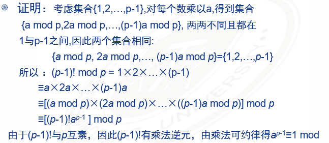

推论：设p是素数，a是一正整数，则$a^p\equiv a\quad mod\quad p$ 

>$a=7,p=19$
>
>$7^2=49\equiv 11\quad mod\quad 19$
>
>$7^4\equiv 121\equiv 7\quad mod\quad 19$
>
>$7^8\equiv 49\equiv 11\quad mod\quad 19$
>
>$7^{16}\equiv 121\equiv 7\quad mod\quad 19$
>
>$a^{p-1}=7^{18}=7^{16}\times 7^2\equiv 7\times 11\equiv 1\quad mod\quad 19 $

## 欧拉函数

- 设n是一正整数，小于n且与n互为素数的正整数的个数称为n的欧拉函数，记为$\varphi(n) $
  例如$\varphi(6)=2, \varphi(7)=6, \varphi(8)=4 $
- 若n是素数，则$\varphi(n)=n-1 $
- 定理：若n是两个素数p和q的乘积，则
  $\varphi(n)=\varphi(p)\times\varphi(q)=(p-1)\times(q-1) $
  例如：$21=3\times7$，得$\varphi(21)=\varphi(3)\times\varphi(7)=2\times6=12 $

### 欧拉定理

若a和n互素，则$a^{\varphi(n)}\equiv1(mod\quad n) $

>证明
>
>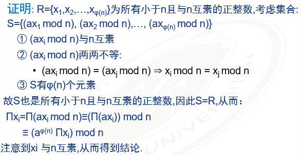

### 欧拉定理推论

>$a^{\varphi(n)+1}\equiv a(mod\quad n) $
>
>若$n=pq,p!=q且都是素数，k为任意正整数，则： $
>$m^{k(p-q)(q-1)+1}\equiv m\quad mod\quad n，对任意的0<=m<=n$

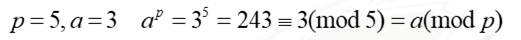

p, q互为素数，则$3^{4+1}\equiv 3(mod\quad n) $

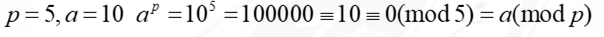

p, q不是素数，此时使用欧拉定理推论 
$10^{(5-1)(2-1)+1}\equiv 10\equiv0(mod\quad 5) $

## 素性检验

指对给定的数检验是否为素数
- 直接判断一个整数是否为素数是困难的
- 对于大数的素性检验来说没有简单直接地方法，目前常用地是概率检验法，如Miller-Rabin算法
- 素数分布密度：在n范围内：平均每$\ln{n}$个整数中有一个素数。所有平均而言，在找到一个素数之前，需要测试地整数个数为$0.5\ln{n} $ 
  
#### 引理

如果p为大于2的素数，则方程$x^2\equiv 1(mod\quad p) $的解只有$x\equiv 1和x\equiv-1 $

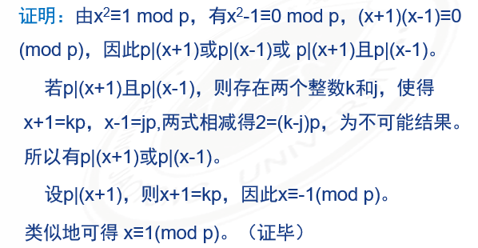

##### 逆否命题

如果$x^2\equiv1\quad mod\quad p $有一解不为{1,-1}，则p不为素数

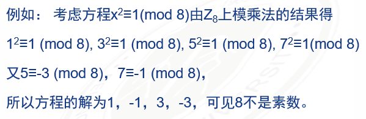

## Miller and Rabin算法

- 目前没有一个高效的算法，实际应用最广泛的是Miller and Rabin算法
- 对奇函数n>=3可代表为$n-1=2^kq $，其中k>0，q为奇数
  
- 素数两个性质
  1. 如果p是素数，a是小于p的正整数，则$a^2\equiv 1(mod\quad p) $当且仅当$a\equiv 1(mod\quad p) $或$a\equiv-1(mod\quad p)=p-1 $
  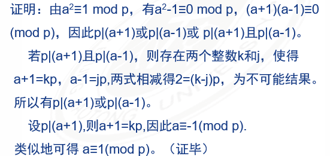
  2. 设p是大于2的素数，我们有$p-1=2^kq$，k>0，q是奇数，设a是整数且$1<a<p-1 $
  - $a^q\equiv 1(mod\quad p)$
  - 存在一个j(1<=j<=k)满足$a^{2^j-1}q\equiv -1\equiv p-1(mod\quad p) $
    数列里有些不为1，但它们的平方模p后为1.满足这一条件的唯一整数为p-1，因此数列里必有一个数为p-1. 
    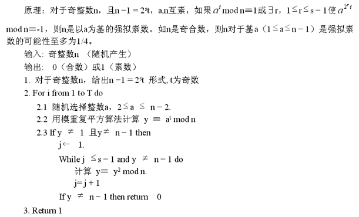
#### 求模幂的模重复平方计算法

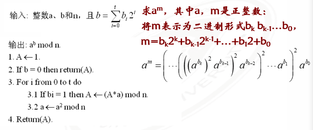

利用miller-rabin算法判断是否为素数

- $(n-1)=28=2^2(7)((n-1)=2^kq) $
- 首先选择a=10，计算$10^7\quad mod\quad 29=17$， 计算$a^q\quad mod\quad n$(判断是否为1或28)，它即不为1也不为28，所以继续测试
- 计算$(10^7)^2\quad mod\quad 29=28((a^k)^2\quad mod\quad n=n-1/1) $，所以n可能是素数
- 选择a=2，计算$2^7\quad mod\quad 29=12, 2^{14}\quad mod\quad 29=28 $，所以29可能是素数
- 如果对1-28之间的所有整数执行测试算法，得到同样结果，则n是素数

#### 应用

- 如何使用Miller-Rabin算法以更高的可信度来判定一个整数是否为素数
- 给定一个非素奇数n和一个随机选择的整数a，($1<a<n$)，算法返回不确定的概率小于1/4(不能确定n不是素数)。因此，如果选择t个不同的a，则它们都能通过测试（返回不确定）的概率小于$(1/4)^t$
- 以大概率确定一个奇整数数素数的过程如下：对随机选取的a，重复调用算法，如果某时刻返回合数，则n一定不是素数，若连续t次返回是素数，当t足够大时，我们认为n是素数

## 中国剩余定理(CRT)

- 《孙子算经》"物不知数"问题：
  
- 求解方法
  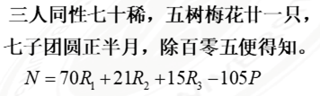
- 南宋数学家秦九韶在《数学九章》中提出"大衍求一术"，系统论述了一次同余式组求解程序。与19世纪高斯《算数探究》中关于一次同余式的解法完全一致。
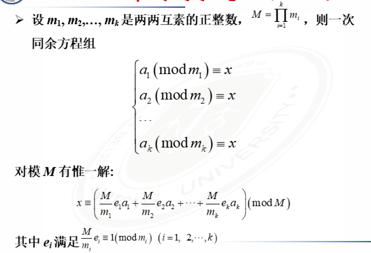
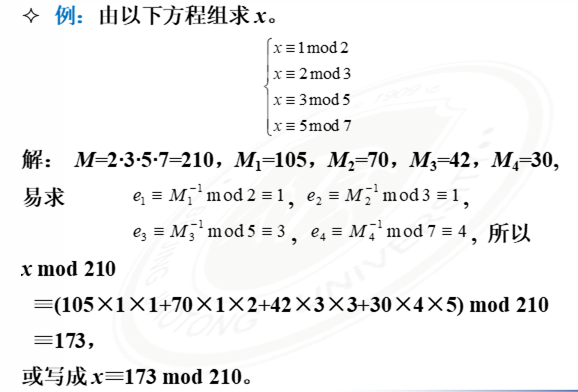

- 中国剩余定理是顺论中最有用的一个工具，定理说<mark>已知某个数关于一些两两互素1的数的同余类集，就可重构这个数</mark>
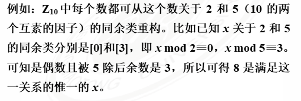

- 在模M下可将非常大的数由一组小数$(a_1,a_2......,a_k) $表达
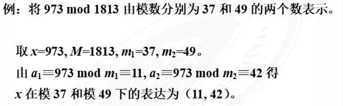
  此性质使得模M的大数运算转化到更小的数上来进行运算，当M为150位或150位以上时，这种方法非常有效

## 离散对数

- 定理：设a的阶为m，则$a^k\equiv 1\quad mod\quad n $的充要条件是k为m的倍数
- 推论：a的阶m整除$\varphi(n) $
- 如果a的阶m等于$\varphi(n) $则称a为n的本原根
- 如果a是n的本原根，则$$a,a^2......,a^{\varPhi(n)}$$在mod n下互不相同且与n互素
- 特别地，如果a是素数p的本原根，则$$a,a^2......,a^{p-1}$$在mod n下都不相同
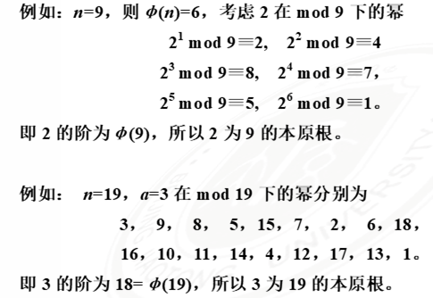

- 本原根不唯一，19的本原根除了3还有2，10，13，14，15
- 注意并非所有的整数都有本原根，只有以下形式的整数才有本原根：$$2,4,p^a,2p^a$$其中p为奇素数。

### 指标

- 一般对数，指数函数$y=a^x$的逆函数称为 **以a为底x的对数，记为$y=\log_a{x}$**.对数函数有以下性质
  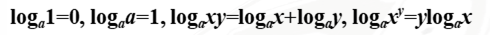
- 在模运算中也有类似的函数。设p是一素数，a是p的本原根，则$a,a^2......,a^{p-1}$产生出1到p-1之间的所有值，且每一值只出现一次。因此对任意 $b\in {1,2,......p-1} $，都存在唯一的$i(1\leq i\leq p-1) $，使得$b\equiv a^i\quad mod\quad p $.称i为模p下以a为底b的离散对数(指标)，记为$i=ind_{a,p}(b) $
- 以上假定模数p是素数，对于非素数也是一样

#### 性质

- $ind_{a,p}(1)=0 $
- $ind_{a,p}(a)=1 $
- $若a^z=a^q\quad mod\quad p，其中a和p互素，则有z\equiv q\quad mod\quad \varphi(p) $
- $ind_{a,p}(xy)=[ind_{a,p}(x)+ind_{a,p}(y)]mod\quad \varphi(p) $
- $ind_{a,p}(y^r)=[r\times ind_{a,p}(y)mod\quad \varphi(p)]$

#### 离散对数的计算

$Y=g^x\quad mod\quad p $

- 已知g,x,p, 计算y是容易的
- 已知y,g,p, 计算x是困难的
- 目前已知的最快的求离散对数算法时间复杂度为
  $$O\bigg\{exp\bigg((\ln{p}^{1/3})\ln{(\ln{p})}\bigg)^{2/3}\bigg\} $$
  所以当p很大时，该算法也不可行